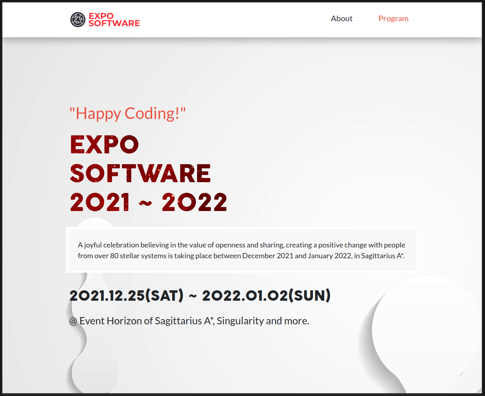

# EXPO SOFTWARE 2021 ~ 2022

> This is the capstone project of the first Microverse course module.

## Built With

- HTML
- CSS
- Javascript

## Live Demo

[Live Demo Link](https://yothu.github.io/module-1-capstone-project/)

## Author

👤 David Vergaray

- GitHub:   [@Yothu](https://github.com/Yothu)
- Twiter:   [@Daivhy](https://twitter.com/Daivhy)
- LinkedIn: [David Vergaray](https://www.linkedin.com/in/david-vergaray-almontes-051a11127/)

## 🤝 Contributing

Contributions, issues, and feature requests are welcome!

Feel free to check the [Issues page](./issues/).

## Show your support

Give a ⭐️ if you like this project!

## Acknowledgments <!-- CHANGE -->

- Hat tip to anyone whose code was used
- Inspiration
- etc

## License

This project is [MIT](./MIT.md) licensed.
